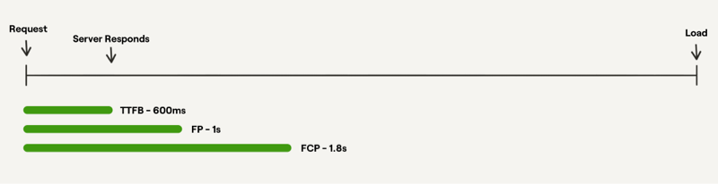
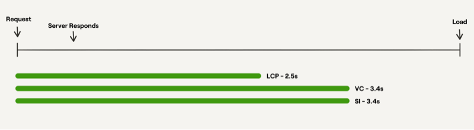
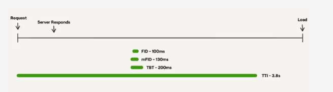
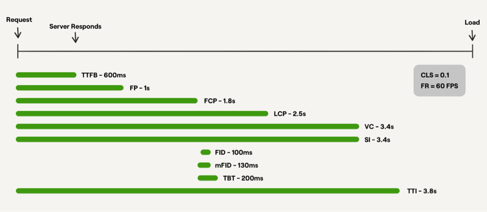

# Web Performance Metrics Cheatsheet

#### Performance metrics are framed around four questions: (https://web.dev/user-centric-performance-metrics/)


1. Is it **happening**?
2. Is it **useful**?
3. Is it **usable**?
4. Is it **delightful**?


###  Is it happening?

---

- Did the navigation start successfully? Has the server responded

- Measure if there is *any* content on the page

- This is about measuring if there is any response after a user starts the navigation to the page. There are three metrics that fall under this category.

  ##### Time to First Byte (TTFB)

  Time to First Byte measures the time from when the browser requests a page to the first byte of the page being received.

  This is really useful for measuring the roundtrip between the user’s device and the server

  A good number to aim for is **600 milliseconds or less**.

#####       First Contentful Paint (FCP)

​		First Contentful Paint measures the time when the first piece of content from the DOM is rendered

​		This is a useful metric to track because this is the point at which a user actually gets recognisable feedback.

​		 A good number for this is **1.8 seconds or less**

​		We need to make sure the content delivers fast. Consider each point of the following schema:

```
	1. Server -> 2. Content -> 3. Internet -> User
```

         1. Server should be capable to process a request as quickly as possible, have stable quick network bandwidth.
            2. Content should be as small as possible and compressed by either Brotli or GZIP.
            3. A number of hops between Server and Client should be minimal. Using of CDN might help for multi-regional websites.




###  Is it useful?

---

- Measure if the content rendered is *actually useful* or meaningful to a user.

- Has enough content rendered that users can engage with it?

  ##### Largest Contentful Paint (LCP)

  Measures the time when the largest piece of content within the viewport is rendered.

  A good number for LCP is 2.5 seconds or less.

  It can also be configured to measure when a specific piece of content is loaded, instead of just the largest by size.

  To render content faster in a browser, we could do the following

  ​     *Defer resources until later*

  		- Use `defer` for scripts.
  		- Put `<script>`s to the bottom of HTML.

  - Lazy-load images and iframes

    

    *Images*

    - Use images optimized for user screen size ``
    - Use `WebP` image format with fallback to `png`.

​      *Reduce network overhead*

- Using HTTP/2 might help. Thanks to multiplexing, a server, and a browser could reuse a connection to transfer muplitple files in parallel, i.e. no need to send HTTP-Request (with all headers) for each file. As for cons, not all servers support it.
- Caching. Headers like `cache-control: max-age=600`, `expires: Wed, May 3 2098` or `etag: somehash` helps to avoid downloading of resources from the server and use it from the cache. **Note:** it works only for returning clients.
- `<link rel="preconnect" href="someresource">` makes the browser to resolve DNS to specified resource. It’s useful when we need some content from third party websites, e.g. Google Fonts.
- `<link rel="preload" href="icons.css">` makes the browser to fetch the specified resource before browser’s main rendering machinery kicks in. This ensures they are available earlier and are less likely to block the page’s render, improving performance.

#####      Visually Complete (VC)

​     Visually Complete measures the time taken for the content within the viewport to be fully rendered

​     There are different Visual Complete metrics you can use based on what percentage to completeness you are trying to track,          e.g. Visually Complete 85% etc.

​     A good number for VC is 3.4 seconds or less.

#####       Speed Index (SI)

​       Measures how quickly content is visually displayed during the page load.

​        SI also takes into account how your site performs in comparison to other sites on the web

​       A good number to aim for is 3.4 seconds or less.



### Is it usable? 

Can users interact with the page, or is it busy?

These metrics are about measuring if a user can actually interact with the content that has been rendered.

##### First Input Delay (FID)

Measures the delay between the time a user can attempt to interact with a part of the site, and the time that the interface is able to respond to that interaction.

Measures *interactivity*

To provide a good user experience, pages should have a FID of **100 milliseconds** or less

The general advice is to do fewer things, i.e. load fewer scripts.

##### Max Potential First Input Delay (mFID)

Max Potential First Input Delay measures the maximum possible First Input Delay that could occur based on the duration of the longest task

This is a useful metric to have because FID is a field metric, which means it's based on real user data and cannot be measured by page simulations (i.e., in the lab)

mFID should be 130 milliseconds or less.

##### Time to Interactive (TTI)

Time from when the page starts loading to when it’s visually rendered its initial scripts have loaded, and it’s capable of responding to user input quickly

Time to Interactive measures the time when the main thread has had up to 5 seconds with no network activity or JavaScript tasks

Having up to 5 seconds clear is important because that’s when the main thread is clear enough to reliably respond to user input.

TTI should be at most 3.8 seconds.

##### Total Blocking Time (TBT)

Total Blocking Time measures the total duration of Javascript tasks between the First Contentful Paint and Time to Interactive.

TBT is expected to be 200 milliseconds or less.



### Is it delightful?

---

Measures the *experience* of the interactions and how enjoyable and pleasant the website is to use.

Are the interactions smooth and natural, free of lag and jank?

##### Cumulative Layout Shift (CLS)

Measures the shifts in layout while a page is loading

Measures *visual stability*

A layout shift occurs when a visible element on your page changes position or size, affecting the position of content around it

This metric is calculated based on how much elements shift relative to the viewport (impact fraction) and what distance they travel (distance fraction)

For example, if a website visitor loaded a page and, while they were reading it, a banner loads and the page jumps down, that would constitute a large CLS score.

 A good score for CLS is 0.1 or less.

When possible avoid inserting DOM elements that shift the layout.

Predefine width and height for images.

Use predefined sizes for lazy-loading content

##### Frame Rate

Frame rate is the rate at which the browser can produce new frames in response to interactions and/or animations

The standard for a smooth frame rate is 60 frames per second.



